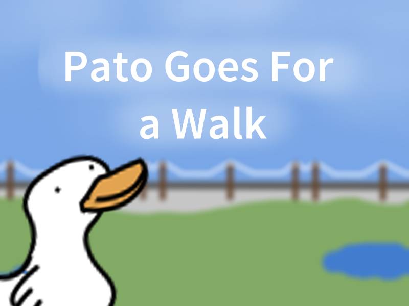

# A game about a duck that collects bread.

## How do you play this game?


## Where can I get the game?
You may download it from the releases tab.

You can also download and run the source:
```
git clone https://github.com/eviluser7/patowalk.git
cd patowalk
python main.py
```
