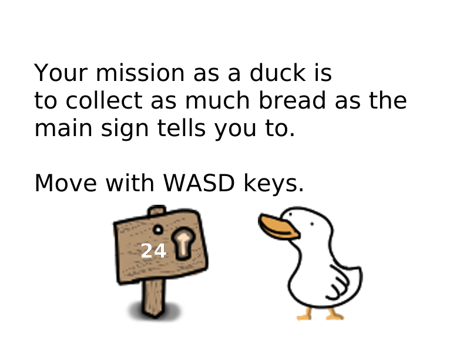

# A game about a duck that collects bread.

## How do you play this game?


## Where can I get the game?
You may download it from the releases tab.

You can also download and run the source:
```
git clone https://github.com/eviluser7/patowalk.git
cd patowalk
python main.py
```
If you're using Windows you'll need the Git Bash, but if you're using Linux, install the git package and everything should be fine.
Dependencies: python 3.8.5, pyglet 1.5.7
Licensed under the Apache-2.0 License.
